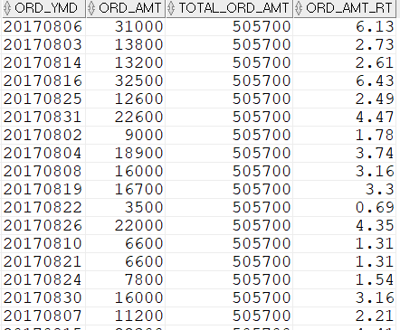

## 17년8월 총주문금액, 주문일자의 주문금액비율구하기
```sql
SELECT  TO_CHAR(T1.ORD_DT, 'YYYYMMDD') ORD_YMD
        ,SUM(T1.ORD_AMT) ORD_AMT
        ,MAX(T2.TOTAL_ORD_AMT) TOTAL_ORD_AMT
        ,ROUND(SUM(T1.ORD_AMT) / MAX(T2.TOTAL_ORD_AMT) * 100, 2) ORD_AMT_RT
FROM    T_ORD T1 --주문테이블
              --17년8월 주문총금액
        ,(    SELECT  SUM(A.ORD_AMT) TOTAL_ORD_AMT
                FROM    T_ORD A 
                WHERE   A.ORD_DT >= TO_DATE('20170801','YYYYMMDD') 
                AND     A.ORD_DT < TO_DATE('20170901','YYYYMMDD')
) T2
WHERE   T1.ORD_DT >= TO_DATE('20170801','YYYYMMDD')
AND     T1.ORD_DT < TO_DATE('20170901','YYYYMMDD')
GROUP BY TO_CHAR(T1.ORD_DT, 'YYYYMMDD');
```


먼저 T2에서 8월 주문총금액을 구한다. 이후 8월달 조회결과에 대해 T1과 카테시안 조인을 한다. 그리고 일자별로 주문총금액과 주문금액비율을 구한다. MAX(T2.TOTAL_ORD_AMT)에서 MAX를 쓴 이유는 SUM으로 할 시 금액이 비정상적으로 높게 나오기 때문이다. 일자별로 여러번 주문한 경우가 있기 때문에 똑같은 금액을 여러번 주문한만큼 더해져서 나온다. 그래서 MAX를 사용하여 데이터가 똑같이 나오게 한다. 