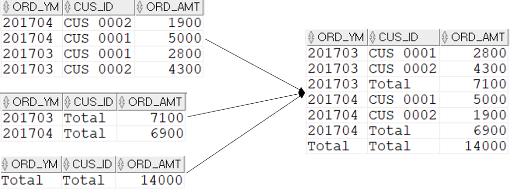

## ROLLUP을 대신하는 방법

#### 1. UNION ALL
```sql
SELECT  TO_CHAR(T1.ORD_DT,'YYYYMM') ORD_YM ,T1.CUS_ID
        ,SUM(T1.ORD_AMT) ORD_AMT
FROM    T_ORD T1
WHERE   T1.CUS_ID IN ('CUS_0001','CUS_0002')
AND     T1.ORD_DT >= TO_DATE('20170301','YYYYMMDD') 
AND     T1.ORD_DT < TO_DATE('20170501','YYYYMMDD')
GROUP BY TO_CHAR(T1.ORD_DT,'YYYYMM') ,T1.CUS_ID
UNION ALL
SELECT  TO_CHAR(T1.ORD_DT,'YYYYMM') ORD_YM ,'Total' CUS_ID
        ,SUM(T1.ORD_AMT) ORD_AMT
FROM    T_ORD T1
WHERE   T1.CUS_ID IN ('CUS_0001','CUS_0002')
AND     T1.ORD_DT >= TO_DATE('20170301','YYYYMMDD') 
AND     T1.ORD_DT < TO_DATE('20170501','YYYYMMDD')
GROUP BY TO_CHAR(T1.ORD_DT,'YYYYMM')
UNION ALL
SELECT  'Total' ORD_YM ,'Total' CUS_ID
        ,SUM(T1.ORD_AMT) ORD_AMT
FROM    T_ORD T1
WHERE   T1.CUS_ID IN ('CUS_0001','CUS_0002')
AND     T1.ORD_DT >= TO_DATE('20170301','YYYYMMDD') 
AND     T1.ORD_DT < TO_DATE('20170501','YYYYMMDD')
order by 1, 2
```


UNION ALL을 사용한 방법은 T_ORD를 세 번 접근하고 있다. 성능에서 손해를 볼 수 밖에 없다. 

#### 2. 카테시안 조인
```sql
SELECT  CASE WHEN T2.RNO = 1 THEN TO_CHAR(T1.ORD_DT,'YYYYMM')
             WHEN T2.RNO = 2 THEN TO_CHAR(T1.ORD_DT,'YYYYMM')
             WHEN T2.RNO = 3 THEN 'Total' END ORD_YM
        ,CASE WHEN T2.RNO = 1 THEN T1.CUS_ID
              WHEN T2.RNO = 2 THEN 'Total'
              WHEN T2.RNO = 3 THEN 'Total' END CUS_ID
        ,SUM(T1.ORD_AMT) ORD_AMT
FROM    T_ORD T1
        ,(
            SELECT ROWNUM RNO FROM DUAL CONNECT BY ROWNUM <= 3
        ) T2
WHERE   T1.CUS_ID IN ('CUS_0001','CUS_0002')
AND     T1.ORD_DT >= TO_DATE('20170301','YYYYMMDD') 
AND     T1.ORD_DT < TO_DATE('20170501','YYYYMMDD')
GROUP BY CASE WHEN T2.RNO = 1 THEN TO_CHAR(T1.ORD_DT,'YYYYMM')
                WHEN T2.RNO = 2 THEN TO_CHAR(T1.ORD_DT,'YYYYMM')
                WHEN T2.RNO = 3 THEN 'Total' END
        ,CASE WHEN T2.RNO = 1 THEN T1.CUS_ID
                WHEN T2.RNO = 2 THEN 'Total'
                WHEN T2.RNO = 3 THEN 'Total' END
                ORDER BY 1, 2;
```

FROM 절에서 T_ORD 테이블과 3건의 로우를 생성하는 테이블을 카테시안 조인한다. 카테시안 조인은 WHERE 절에 조인 조건이 없다. 그러므로 T_ORD에서 나온 데이터와 3건의 로우를 곱한만큼 데이터가 나온다. 결과는 아래와 같다.


RNO 2와 3은 각각 주문날짜별 소계와 전체합계를 구하기 위해서 존재한다.

#### 3. WITH와 UNION ALL로 대신하기
```sql
WITH T_RES AS(
        SELECT  TO_CHAR(T1.ORD_DT,'YYYYMM') ORD_YM ,T1.CUS_ID
                ,SUM(T1.ORD_AMT) ORD_AMT
        FROM    T_ORD T1
        WHERE   T1.CUS_ID IN ('CUS_0001','CUS_0002')
        AND     T1.ORD_DT >= TO_DATE('20170301','YYYYMMDD') 
        AND     T1.ORD_DT < TO_DATE('20170501','YYYYMMDD')
        GROUP BY TO_CHAR(T1.ORD_DT,'YYYYMM') ,T1.CUS_ID
        )
SELECT  T1.ORD_YM ,T1.CUS_ID ,T1.ORD_AMT
FROM    T_RES T1
UNION ALL
SELECT  T1.ORD_YM ,'Total' ,SUM(T1.ORD_AMT)
FROM    T_RES T1
GROUP BY T1.ORD_YM
UNION ALL
SELECT  'Total' ,'Total' ,SUM(T1.ORD_AMT)
FROM    T_RES T1;
```
