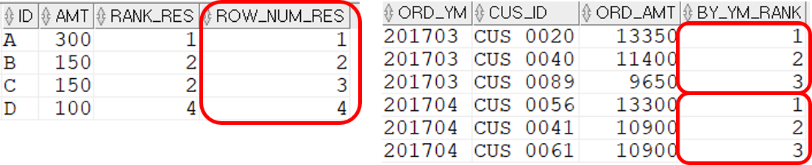
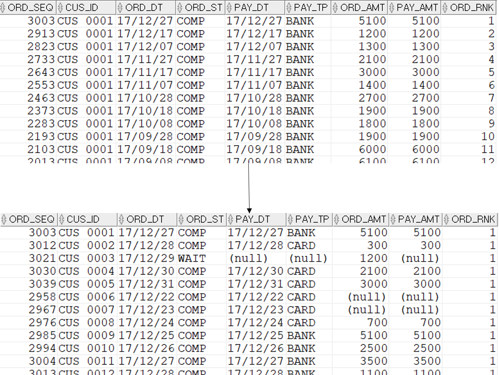

## ROW_NUMBER 사용법
```sql
--ROW_NUMBER를 사용한 순위구하기
SELECT  T1.ID ,T1.AMT
        ,RANK() OVER(ORDER BY T1.AMT DESC) RANK_RES
        ,ROW_NUMBER() OVER(ORDER BY T1.AMT DESC) ROW_NUM_RES
FROM    (
        SELECT  'A' ID ,300 AMT FROM DUAL UNION ALL
        SELECT  'B' ID ,150 AMT FROM DUAL UNION ALL
        SELECT  'C' ID ,150 AMT FROM DUAL UNION ALL
        SELECT  'D' ID ,100 AMT FROM DUAL 
        ) T1;
            
--3월, 4월 주문에 대해, 월별로 주문금액 TOP 3 구하기
SELECT  T0.ORD_YM ,T0.CUS_ID ,T0.ORD_AMT ,T0.BY_YM_RANK
FROM    (
        SELECT  TO_CHAR(T1.ORD_DT,'YYYYMM') ORD_YM ,T1.CUS_ID ,SUM(T1.ORD_AMT) ORD_AMT
                ,ROW_NUMBER()
                    OVER(PARTITION BY TO_CHAR(T1.ORD_DT,'YYYYMM') ORDER BY SUM(T1.ORD_AMT) DESC) BY_YM_RANK
        FROM    T_ORD T1
        WHERE   T1.ORD_DT >= TO_DATE('20170301','YYYYMMDD')
        AND     T1.ORD_DT < TO_DATE('20170501','YYYYMMDD')
        GROUP BY TO_CHAR(T1.ORD_DT,'YYYYMM')
                ,T1.CUS_ID
        ) T0
        --품목별 TOP3나 판매점별 TOP3를 구하기 위해 사용하는 패턴이다.
        --T0.BY_YM_RANK <= 3
WHERE   T0.BY_YM_RANK <= 3
ORDER BY T0.ORD_YM ,T0.BY_YM_RANK;
```


## 고객별 마지막 주문조회하기
```sql
SELECT  T2.*
FROM    (
        SELECT  T1.*
                ,ROW_NUMBER()
                    OVER(PARTITION BY T1.CUS_ID ORDER BY T1.ORD_DT DESC ,T1.ORD_SEQ DESC) ORD_RNK
        FROM    T_ORD T1
        ) T2
WHERE   T2.ORD_RNK = 1;
```
