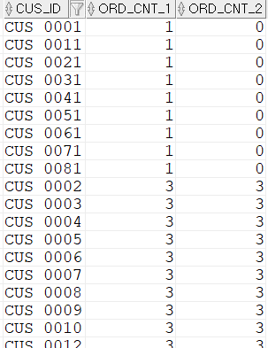
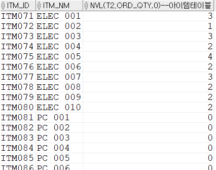

## 고객별 1월 주문건수 구하기(주문이 없는 고객도 조회되게)
고객 테이블을 기준 집합으로 아우터 조인했기 때문에, 주문이 없는 고객도 모두 조회가 가능하다. 아래 SQL에서 COUNT(*)와 COUNT(T2.ORD_SEQ)를 사용했는데 이 중에 필요한 결과는 COUNT(T2.ORD_SEQ)이다. 1월에 주문이 하나도 없는 고객을 0으로 표시해야 되기 때문이다. 아우터 조인에서 COUNT 집계함수를 사용할 때는 항상 주의가 필요하다. **COUNT 대상이 실적건수라면 COUNT(T2.ORD_SEQ)와 같이 참조테이블의 컬럼을 사용해야 한다.**

```sql
SELECT  T1.CUS_ID
        ,COUNT(*) ORD_CNT_1
        ,COUNT(T2.ORD_SEQ) ORD_CNT_2
FROM    M_CUS T1 --고객테이블
        ,T_ORD T2 --주문테이블
WHERE   T1.CUS_ID = T2.CUS_ID(+)
AND     T2.ORD_DT(+) >= TO_DATE('20170101','YYYYMMDD')
AND     T2.ORD_DT(+) < TO_DATE('20170201','YYYYMMDD')
GROUP BY T1.CUS_ID
ORDER BY COUNT(*) ,T1.CUS_ID;
```


#### 아이템ID별 주문수량구하기
'PC, ELEC' 아이템 유형의 아이템별 주문수량 조회(주문이 없어도 0으로 나와야 한다.)

```sql
SELECT  T1.ITM_ID ,T1.ITM_NM ,NVL(T2.ORD_QTY,0)
      --아이템테이블
FROM    M_ITM T1         
        ,(  -- 1월 아이템아이디별 주문수량이 출력됨.
            SELECT  B.ITM_ID ,SUM(B.ORD_QTY) ORD_QTY
            FROM    T_ORD A --주문테이블
                   ,T_ORD_DET B --주문상세테이블      
            WHERE   A.ORD_SEQ = B.ORD_SEQ --주문시퀀스
            AND     A.ORD_ST = 'COMP' --주문상태=완료
            AND     A.ORD_DT >= TO_DATE('20170101','YYYYMMDD')
            AND     A.ORD_DT < TO_DATE('20170201','YYYYMMDD')
            GROUP BY B.ITM_ID ) T2
        --T1 테이블에 PC와 ELEC 유형만 필터링되어 T2테이블과 아우터조인됨.
WHERE   T1.ITM_ID = T2.ITM_ID(+)
AND     T1.ITM_TP IN ('PC','ELEC')
ORDER BY T1.ITM_TP ,T1.ITM_ID;
```


**위 SQL은 인라인 뷰를 사용해 실적 데이터를 M_ITM 테이블의 PK 단위인 ITM_ID로 'GROUP BY'한 후에 조인하고 있다. 이처럼 SQL을 작성하면 가독성이 좀 더 좋다. 가독성이 좋은 SQL은 향후 유지 보수에 도움이 된다.** 

#### 아우터 조인 이해하기
- 기준데이터 집합 : 아우터 조인의 기준이 되는 집합
- 참조데이터 집합 : 아우터 조인의 참조가 되는 집합

기준 데이터 집합은 조인 조건을 만족하지 않아도 모두 결과에 포함된다. 
아우터 조인을 사용하려면 조인 조건 컬럼 한쪽에 '(+)'표시를 추가하면 된다. 조인 조건에 '(+)'표시가 붙은 쪽은 '참조 데이터 집합', 없는 쪽은 '기준 데이터 집합'이다. 

- 아우터 조인의 필터조건
    - 참조 쪽 필터 조건에 (+) 사용 : 아우터 조인 전에 필터 조건이 사용된다.
    - 참조 쪽 필터 조건에 (+) 미사용 : 아우터 조인 후, 조인 결과에 필터 조건이 사용된다.  
    - **결론은 (+)을 사용해야 한다.**
####
- 아우터 조인에서 '(+)'표시가 된 참조 데이터 집합은 두 개 이상의 기준 데이터 집합을 동시에 가질 수 없다. 
####
- 여러 테이블이 조인될 때, 아우터 조인이 수행된 참조 데이터 집합은 기준 집합이 되어서 다른 테이블과 아우터 조인해야 한다. 