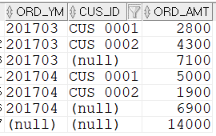

## 소계(중간합계)와 전체합계 구하기
소계(중간합계)와 전체합계를 구하기 위해서는 ROLLUP이 가장 효율적이다. 
- ROLLUP은 GROUP BY뒤에 ROLLUP이라고 적어서 사용한다. 예를들어 GROUP BY ROLLUP(A, B, C, D)라고 사용하면 다음과 같은 데이터들이 조회된다.
   - GROUP BY된 A+B+C+D별 데이터
   - A+B+C별 소계 데이터
   - A+B별 소계 데이터
   - A별 소계 데이터
   - 전체합계

아래 SQL을 보자.
```sql
SELECT TO_CHAR(T1.ORD_DT,'YYYYMM') ORD_YM 
        ,T1.CUS_ID
        ,SUM(T1.ORD_AMT) ORD_AMT
FROM    T_ORD T1
WHERE   T1.CUS_ID IN ('CUS_0001','CUS_0002')
AND     T1.ORD_DT >= TO_DATE('20170301','YYYYMMDD') 
AND     T1.ORD_DT < TO_DATE('20170501','YYYYMMDD')
GROUP BY 
ROLLUP(TO_CHAR(T1.ORD_DT,'YYYYMM') ,T1.CUS_ID);
```


위 SQL은 TO_CHAR(T1.ORD_DT,'YYYYMM')에 대해서 소계가 만들어지고 전체합계가 표시된다. 

#### ROLLUP의 컬럼 순서
- ROLLUP에서 컬럼 순서는 매우 중요하다. 컬럼순서에 따라 다른 소계가 나오기 때문이다.
    1. GROUP BY ROLLUP(A, B, C, D): A+B+C별 소계, A+B별 소계, A별 소계, 전체합계
    2. GROUP BY ROLLUP(B, A, C, D): B+A+C별 소계, B+A별 소계, B별 소계, 전체합계