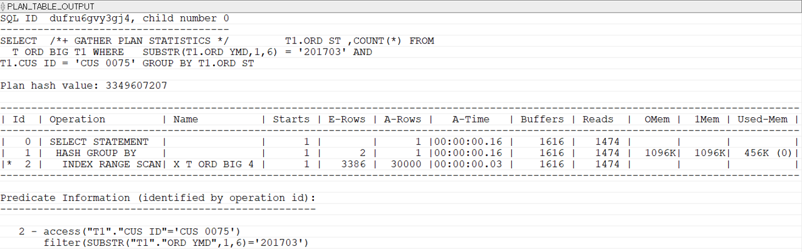
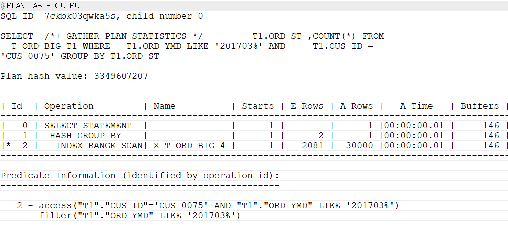

## Predicate Information - ACCESS
아래 SQL을 보자.
```sql
-- CUS_0075의 201703주문을 조회하는 SQL
SELECT  /*+ GATHER_PLAN_STATISTICS */
        T1.ORD_ST ,COUNT(*)
FROM    T_ORD_BIG T1
WHERE   SUBSTR(T1.ORD_YMD,1,6) = '201703'
AND     T1.CUS_ID = 'CUS_0075'
GROUP BY T1.ORD_ST;
```

실행계획을 보면 'X_T_ORD_BIG_4' 인덱스를 INDEX RANGE SCAN하고 있다. 인덱스를 탔다고 할 수 있다. 하지만 인덱스를 제대로 탔는지는 11, 12번 라인의 Predicate Information을 살펴봐야 한다.
####
access는 인덱스 리프 블록의 스캔 시작 위치를 찾는 데 사용한 조건이고 filter는 리프 블록을 차례대로 스캔하면서 처리한 조건이다. 다시 말해 리프 블록의 검색 시작 위치를 찾을 때는 CUS_ID 조건만 사용되었다. 인덱스를 제대로 탔다면 ORD_YMD에 대한 조건도 access에 표시되어야 한다. 
####
인덱스에는 SUBSTR 적용 이전의 원래 값만 저장되어 있다. 그러므로 인덱스로 구성한 컬럼을 변형해 조건절에서 사용하면 인덱스를 제대로 사용할 수 없다.
####
ORD_YMD 컬럼에 SUBSTR을 제거하고, LIKE 조건을 이용해 SQL을 실행해보자.

```sql
-- CUS_0075의 201703주문을 조회하는 SQL – LIKE로 처리
SELECT  /*+ GATHER_PLAN_STATISTICS */
        T1.ORD_ST ,COUNT(*)
FROM    T_ORD_BIG T1
WHERE   T1.ORD_YMD LIKE '201703%'
AND     T1.CUS_ID = 'CUS_0075'
GROUP BY T1.ORD_ST;
```

CUS_ID와 ORD_YMD가 access하고 있다. 이번에야말로 인덱스를 제대로 탔다. buffers 수치도 1616에서 146으로 줄었다. 

Predicate Information의 access 조건을 확인하는 것은 매우 중요하다. 같은 인덱스를 사용한다고 해도 어느 조건까지 access했는지에 따라 성능 차이가 난다. 