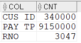

## 단일 인덱스 컬럼정하는 방법
인덱스는 조건에 맞는 데이터를 빠르게 찾기 위한 객체다. WHERE 조건절에 사용된 컬럼에 인덱스를 구성하는 것이 기본원리이다. 

아래 SQL의 성능개선을 위한 하나의 단일 인덱스를 고려해보자. 후보 컬럼은 WHERE 절에 사용된 CUS_ID, PAY_TP, RNO 이다.
```sql
-- 인덱스가 필요한 SQL
SELECT  /*+ GATHER_PLAN_STATISTICS */
        TO_CHAR(T1.ORD_DT,'YYYYMM') ,COUNT(*)
FROM    T_ORD_BIG T1
WHERE   T1.CUS_ID = 'CUS_0064'
AND     T1.PAY_TP = 'BANK'
AND     T1.RNO = 2
GROUP BY TO_CHAR(T1.ORD_DT,'YYYYMM');
```
인덱스 컬럼 선정에 아래 SQL이 도움이 된다.
```sql
-- 효율적인 단일 인덱스 찾기
SELECT  'CUS_ID' COL ,COUNT(*) CNT FROM T_ORD_BIG T1 WHERE T1.CUS_ID = 'CUS_0064'
UNION ALL
SELECT  'PAY_TP' COL ,COUNT(*) CNT FROM T_ORD_BIG T1 WHERE T1.PAY_TP = 'BANK'
UNION ALL
SELECT  'RNO' COL ,COUNT(*) CNT FROM T_ORD_BIG T1 WHERE T1.RNO = 2;
```


주어진 조건에 해당하는 데이터가 적을 수록 좋고, 데이터가 많을 수록 안좋다. 

RNO = 2가 3047건으로 가장 적다. RNO 조건이 좋고 그 다음으로 CUS_ID가 좋다. 그러므로 RNO로 단일 인덱스를 만드는 것이 좋다. 
```sql
-- RNO 에 대한 단일 인덱스 생성
CREATE INDEX X_T_ORD_BIG_2 ON T_ORD_BIG(RNO);

-- RNO에 대한 단일 인덱스 생성 후 SQL수행
SELECT  /*+ GATHER_PLAN_STATISTICS INDEX(T1 X_T_ORD_BIG_2) */
        TO_CHAR(T1.ORD_DT,'YYYYMM') ,COUNT(*)
FROM    T_ORD_BIG T1 
WHERE   T1.CUS_ID = 'CUS_0064'
AND     T1.PAY_TP = 'BANK'
AND     T1.RNO = 2
GROUP BY TO_CHAR(T1.ORD_DT,'YYYYMM');
```

가장 먼저 T1 X_T_ORD_BIG_2 인덱스를 이용해 조건에 맞는 데이터를 찾는다. 이 때 찾은 데이터 건수는 3,047건이다. 찾아낸 3047건에 대해 TABLE ACCESS BY INDEX ROWID를 수행한다. 2건이 나온다. 이 2건을 GROUP BY 해서 최종 결과로 내보내다. 

만약에 CUS_ID를 인덱스로 하면 INDEX RANGE SCAN에서 나온 34만건에대해 TABLE ACCESS BY INDEX ROWID도 34만번 수행할 것이다. 그러므로 성능이 더 나쁠 수 밖에 없다. 