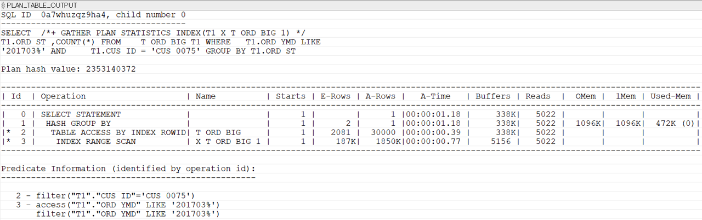
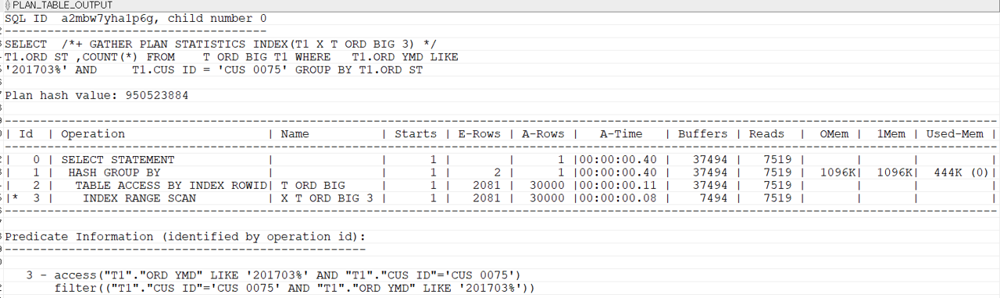

## 단일인덱스 vs 복합인덱스
인덱스가 테이블의 조회 속도를 개선하는 것은 분명한 사실이지만, 인덱스가 많아질수록 입력, 수정, 삭제에서는 성능 감소가 발생한다. 데이터 변경이 발생할 때마다 인덱스 역시 변경을 해주어야 하기 때문이다. 이와 같은 이유로 복합 인덱스를 이용해 인덱스의 수를 줄이는 것이 매우 중요하다. 

아래 SQL을 실행해보자. 
```sql
-- 2개의 조건이 사용된 SQL – ORD_YMD인덱스를 사용
SELECT  /*+ GATHER_PLAN_STATISTICS INDEX(T1 X_T_ORD_BIG_1) */
        T1.ORD_ST ,COUNT(*)
FROM    T_ORD_BIG T1
WHERE   T1.ORD_YMD LIKE '201703%'
AND     T1.CUS_ID = 'CUS_0075'
GROUP BY T1.ORD_ST;
```

INDEX RANGE SCAN 시 A-Rows가 1850k이다. 랜덤 액세스가 1850k 발생한 것이다. 즉, ORD_YMD LIKE 201703%인 데이터가 1850k이고 CUS_ID를 확인하기위해 1850k번 테이블에 접근한다. 

이번에는 ORD_YMD와 CUS_ID 컬럼 두개로 복합인덱스를 만들어 SQL을 실행해보자.
```sql
-- ORD_YMD, CUS_ID순으로 복합 인덱스를 생성
CREATE INDEX X_T_ORD_BIG_3 ON T_ORD_BIG(ORD_YMD, CUS_ID);

-- ORD_YMD, CUS_ID 복합 인덱스를 사용하도록 SQL을 수행
SELECT  /*+ GATHER_PLAN_STATISTICS INDEX(T1 X_T_ORD_BIG_3) */
        T1.ORD_ST ,COUNT(*)
FROM    T_ORD_BIG T1
WHERE   T1.ORD_YMD LIKE '201703%'
AND     T1.CUS_ID = 'CUS_0075'
GROUP BY T1.ORD_ST;
```

시간이 1.2초 걸리던 것이 0.4초로 좋아졌다. 
인덱스에 ORD_YMD와 CUS_ID 정보가 모두 있다. CUS_ID에 대해 테이블에 접근하지 않아도 조건에 맞는 데이터를 찾을 수 있기 때문이다. 다만, select 절에 사용된 ORD_ST컬럼은 테이블에 접근해야 하므로 30000번의 테이블 접근은 피할 수 없다. 
TABLE ACCESS BY INDEX ROWID가 1850k에서 30000번으로 줄었기 때문에 성능 개선이 이루어졌다. 

인덱스를 설계할 때 중요한 것이 테이블 접근을 줄이는 것이다. WHERE 절에 모든 컬럼을 복합 인덱스로 구성하면 테이블 접근을 최소화할 수 있다. 하지만 복합 인덱스에 너무 많은 컬럼을 설정하면 데이터의 입력, 수정, 삭제에서 성능 저하가 일어난다. 그러므로 적절한 컬럼 수로 복합 인덱스를 구성해야 한다.