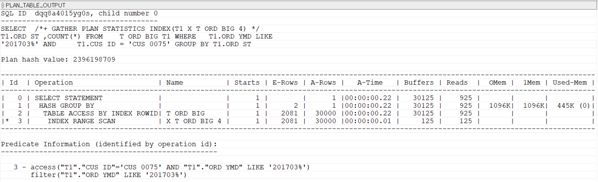

## 복합 인덱스 사용법
'A, B, C'컬럼 순서의 복합 인덱스와 'C, B, A' 순서의 복합 인덱스는 완전히 다른 인덱스다.

복합 인덱스를 만들 때 가장 중요한 것은 인덱스를 구성하는 컬럼 순서다. 

ORD_YMD와 CUS_ID 순서로 구성된 복합 인덱스를 사용한 SQL이다.
```sql
-- 2개의 조건이 사용된 SQL
SELECT  /*+ GATHER_PLAN_STATISTICS INDEX(T1 X_T_ORD_BIG_3) */
        T1.ORD_ST ,COUNT(*)
FROM    T_ORD_BIG T1
WHERE   T1.ORD_YMD LIKE '201703%'
AND     T1.CUS_ID = 'CUS_0075'
GROUP BY T1.ORD_ST;
```
복합 인덱스의 컬럼 순서를 정할 때 같다(=)조건이 사용된 컬럼을 복합 인덱스의 앞 부분에 두는 것이 기본 원칙이다.
```sql
-- CUS_ID, ORD_YMD로 구성된 인덱스
CREATE INDEX X_T_ORD_BIG_4 ON T_ORD_BIG(CUS_ID, ORD_YMD);

-- CUS_ID, ORD_YMD인덱스를 사용하는 SQL
SELECT  /*+ GATHER_PLAN_STATISTICS INDEX(T1 X_T_ORD_BIG_4) */
        T1.ORD_ST ,COUNT(*)
FROM    T_ORD_BIG T1
WHERE   T1.ORD_YMD LIKE '201703%'
AND     T1.CUS_ID = 'CUS_0075'
GROUP BY T1.ORD_ST;
```

실행시간이 0.4에서 0.2로 단축되었다. 실행시간보다는 INDEX RANGE SCAN의 Buffers 항목을 보자. ORD_YMD, CUS_ID 순서의 복합 인덱스를 했을 때 Buffers는 7494였지만, CUS_ID, ORD_YMD 순서의 인덱스를 사용하자 125로 개선되었다. 즉, 컬럼순서를 변경해 7000블록 정도의 IO를 줄였다.

첫번째 컬럼이 범위조건으로 사용되면 인덱스의 두 번째 컬럼은 **리프 검색의 시작 위치**를 찾아내는 데 관여하지 못한다. 그뿐아니라 CUST_ID가 ORD_YMD별로 흩어져 있다.

반면, 선두 컬럼이 같다조건으로 사용되어야만 두 번째 컬럼도 리프 블록의 시작위치를 찾는데 관여할 수 있다. 그리고 데이터가 찾고자 하는 데이터가 잘 모여있다.

#### 기억할 점
- 같다(=) 조건이 사용된 컬럼이 복합 인덱스의 앞부분에 위치해야 한다.
- 인덱스를 만들 때, 해당 테이블에 대한 SQL 전체를 검토하여 전체 SQL의 성능이 좋아지는 방향으로 인덱스를 최소구성해야 한다.
- 조건에 사용된 모든 컬럼을 무조건 복합 인덱스에 추가해서는 안된다.(성능에 도움이 되는 조건 컬럼만 선별해서 복합 인덱스를 구현하도록 한다. 인덱스를 구성하는 컬럼이 너무 많아도 안좋다.) 아래와 같이 조건별 SQL을 실행해 가장 적게 나오는 ORD_YMD와 CUS_ID정도로 복합 인덱스를 구성하면된다.
```sql
-- 각 조건별로 카운트 해보기
SELECT  'ORD_AMT' COL ,COUNT(*) FROM T_ORD_BIG T1 WHERE T1.ORD_AMT = 2400
UNION ALL
SELECT  'PAY_TP' COL ,COUNT(*) FROM T_ORD_BIG T1 WHERE T1.PAY_TP = 'CARD'
UNION ALL
SELECT  'ORD_YMD' COL ,COUNT(*) FROM T_ORD_BIG T1 WHERE T1.ORD_YMD = '20170406'
UNION ALL
SELECT  'ORD_ST' COL ,COUNT(*) FROM T_ORD_BIG T1 WHERE T1.ORD_ST = 'COMP'
UNION ALL
SELECT  'CUS_ID' COL ,COUNT(*)  FROM T_ORD_BIG T1 WHERE T1.CUS_ID = 'CUS_0036';
```