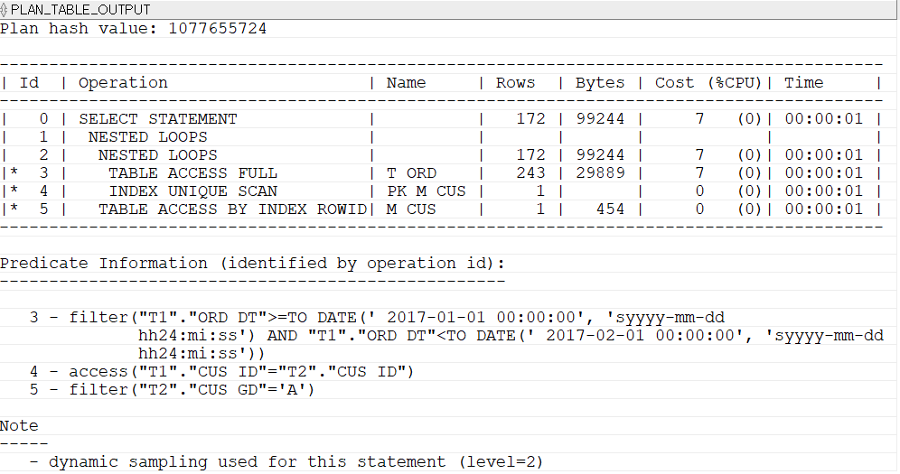
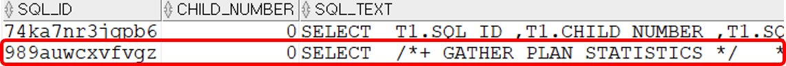
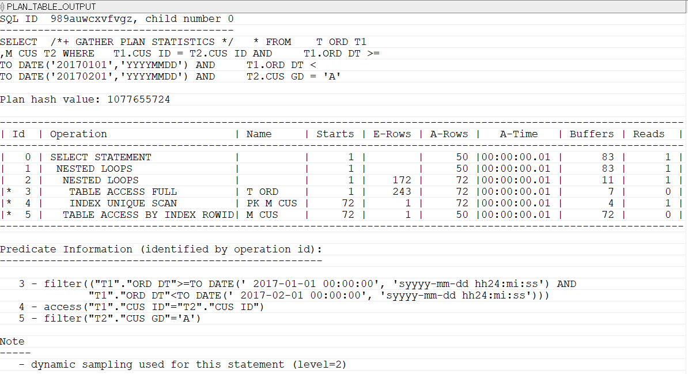

## 실행계획

#### 실행계획 만들기
```sql
--실행계획을 만들어 PLAN 테이블에 저장하기만 한다.
EXPLAIN PLAN FOR
SELECT * FROM T_ORD WHERE ORD_SEQ = 4;
```
#### 실행계획 확인하기
```sql
SELECT * FROM TABLE(DBMS_XPLAN.DISPLAY());
```

실행계획에는 ID 항목이 있는데 실행계획의 단계를 구분하는 식별자이다. 실행계획이 실행되는 순서가 아니다.
여기서 살펴본 실행계획은 SQL을 실행하기 전의 '예상' 실행계획이다. 그러므로 여기에 나오는 항목별 수치는 '실제'가 아니라 '예상'이다. 예상 실행 계획만으로도 얼마든지 SQL 성능 개선을 할 수 있다. 
####

실행계획에 표시되는 각 항목의 의미를 알아보자.
- id: 오퍼레이션 ID
- Operation: 해당 단계에 수행한 작업 내용
- Name: 해당 단계에 작업을 수행한 대상 오브젝트(테이블 또는 인덱스)
- Rows: 해당 단계 수행 시 조회될 예상 데이터 건수
- Bytes: 해당 단계까지 사용될 예상 데이터양(누적)
- cost: 해당 단계까지 사용될 예상비용(누적)
- Time: 해당 단계까지 사용될 예상시간(누적)

#### 실행계획의 순서 파악하기
```sql
EXPLAIN PLAN FOR
SELECT  *
FROM    T_ORD T1
        ,M_CUS T2
WHERE   T1.CUS_ID = T2.CUS_ID
AND     T1.ORD_DT >= TO_DATE('20170101','YYYYMMDD')
AND     T1.ORD_DT < TO_DATE('20170201','YYYYMMDD')
AND     T2.CUS_GD = 'A';

SELECT  *
FROM    TABLE(DBMS_XPLAN.DISPLAY());
```


위 실행계획을 사용해 부모, 자식, 형제 관계를 정의하면 아래와 같다.
- 부모는 여러 자식을 가질 수 있다. 자식은 부모보다 들여쓰기 되어 있다.
-> 위 실행계획에서 오퍼레이션1은 오퍼레이션2와 3의 부모이다.
- 형제는 같은 들여쓰기 수준을 하고 있다.
-> 위 실행계획에서 오퍼레이션2와 3은 형제 관계이다.
- 형제 중에는 위쪽의 오퍼레이션이 형이다.
-> 위 실행계획에서 2와 3중에 2가 형이다.

오퍼레이션이 실행되는 기본적인 순서는 아래와 같다.
- 자식이 부모보다 먼저 수행된다.
-> 오퍼레이션 2와 3은 1의 자식이다. 2와 3이 1보다 먼저 수행된다.
-> 오퍼레이션 1은 오퍼레이션 0의 자식이다. 1이 0보다 먼저 수행된다.
- 형제 간에는 형이 먼저 수행된다.
-> 오퍼레이션 2와 3은 형제다. 2가 형이다. 그러므로 2가 3보다 먼저 수행된다.

#### 실제 실행계획 확인하기
지금까지는 예상 실행계획을 살펴봤다. 예상 실행계획만으로는 성능 개선이 어려울 때가 있다. 이런 경우 실제 실행계획을 보는 것이 좋다. 

실행계획을 확인하려면 'GATHER_PLAN_STATISTICS' 힌트를 사용하면 된다. 
그 후 DBMS_XPLAN.DISPLAY_CURSOR를 이용해 실행계획을 확인할 수 있다. 
####
DBMS_XPLAN.DISPLAY_CURSOR를 이용하려면 아래와 같은 뷰에 SELECT 권한이 필요하다.
- V_$SQL
- V_$SQL_PLAN_STATISTICS_ALL
- V_$SQL_PLAN
- V_$SESSION

```sql
-- 실제 실행계획 만들기
SELECT  /*+ GATHER_PLAN_STATISTICS */
		*
FROM    T_ORD T1
        ,M_CUS T2
WHERE   T1.CUS_ID = T2.CUS_ID
AND     T1.ORD_DT >= TO_DATE('20170101','YYYYMMDD')
AND     T1.ORD_DT < TO_DATE('20170201','YYYYMMDD')
AND     T2.CUS_GD = 'A';
```
실제 실행계획을 확인하려면 GATHER_PLAN_STATISTICS 힌트를 사용한 SQL의 SQL_ID와 CHILD_NUMBER가 필요하다. 위 SQL이 실행 완료되면, 아래 SQL로 필요한 값을 얻을 수 있다.
```sql
-- 실제 실행계획을 만든 SQL의 SQL_ID찾아내기
SELECT  T1.SQL_ID ,T1.CHILD_NUMBER ,T1.SQL_TEXT 
FROM    V$SQL T1
WHERE   T1.SQL_TEXT LIKE '%GATHER_PLAN_STATISTICS%'
ORDER BY T1.LAST_ACTIVE_TIME DESC;
```


```sql
-- 실제 실행계획 조회하기(각자의 SQL_ID를 사용할 것)
SELECT  *
FROM    TABLE(DBMS_XPLAN.DISPLAY_CURSOR('989auwcxvfvgz',0,'ALLSTATS LAST'));
```


항목들을 살펴보자.
- Starts: 해당 단계를 수행한 횟수
- E-Rows: 해당 단계의 예상 데이터 건수
- **A-Rows: 해당 단계의 실제 데이터 건수**
- **A-Time: 해당 단계까지 수행된 실제시간(누적)**
- **Buffers: 해당 단계까지 메모리 버퍼에서 읽은 블록 수(논리적 IO횟수, 누적)**
- Reads: 해당 단계까지 디스크에서 읽은 블록 수(물리적 IO 횟수, 누적)