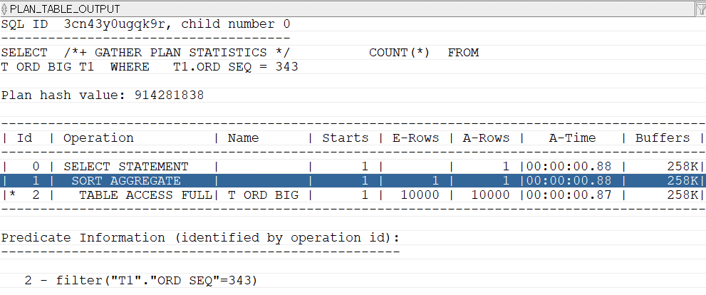
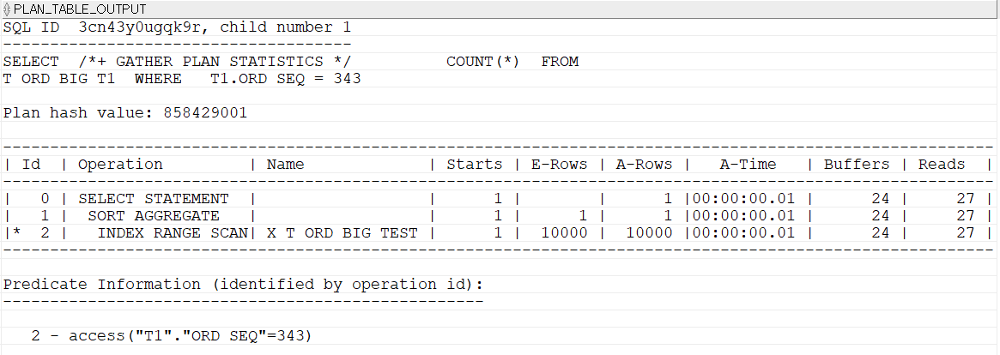

## 인덱스
인덱스는 색인이다. 색인이란 책 속의 내용 중에서 중요한 내용이나 단어를 찾아볼 수 있도록 별도로 배열하여 놓은 목록이다. 데이터베이스에서 인덱스 역시 테이블 내의 데이터를 찾을 수 있게 일부 데이터를 모아서 구성한 데이터 구조이다. 

#### 테스트를 위한 테이블 만들기
```sql
-- 테스트를 위한 테이블 만들기
-- PK까지 생성되진 않는다. alter 명령어로 추가해야함.
CREATE TABLE T_ORD_BIG AS
SELECT  T1.* ,T2.RNO ,TO_CHAR(T1.ORD_DT,'YYYYMMDD') ORD_YMD
FROM    T_ORD T1
        ,(SELECT ROWNUM RNO
          FROM DUAL CONNECT BY ROWNUM <= 10000) T2
          ;

-- 아래는 T_ORD_BIG 테이블의 통계를 생성하는 명령어다.
-- 첫 번째 파라미터에는 테이블 OWNER를, 두 번째 파라미터에는 테이블 명을 입력한다.
EXEC DBMS_STATS.GATHER_TABLE_STATS('ORA_SQL_TEST','T_ORD_BIG');
```
위 SQL을 실행하면 T_ORD_BIG 테이블에 3천만건 정도의 데이터가 입력된다. 성능 테스트에 충분한 양이다. 효율적인 성능 테스트와 인덱스 설명을 위해 'ORD_YMD'와 'RNO' 컬럼도 추가했다. 올바른 성능 테스트를 위해서는 위와 같이 통계정보를 반드시 만들어 주어야 한다.(DBMS_STATS의 실행권한이 필요하다.)

통계정보 생성까지 완료한 뒤, 아래와 같이 ORD_SEQ가 343인 데이터를 카운트한 뒤 실제 실행계획을 확인해보자.
```sql
-- 인덱스가 없는 BIG테이블 조회
SELECT  /*+ GATHER_PLAN_STATISTICS */ 
        COUNT(*) 
FROM    T_ORD_BIG T1 
WHERE   T1.ORD_SEQ = 343;

SELECT  T1.SQL_ID ,T1.CHILD_NUMBER ,T1.SQL_TEXT 
FROM    V$SQL T1
WHERE   T1.SQL_TEXT LIKE '%GATHER_PLAN_STATISTICS%'
ORDER BY T1.LAST_ACTIVE_TIME DESC;

--실제 실행계획 확인하기
SELECT  *
FROM    TABLE(DBMS_XPLAN.DISPLAY_CURSOR('3cn43y0ugqk9r',0,'ALLSTATS LAST'));
```

실행계획을 보니  약 0.9초 정도 걸렸다. 전체 Buffers(논리적IO)는 258K가 나왔다.  T_ORD_BIG 테이블에 "TABLE ACCESS FULL" 작업을 한 다음에 "SORT AGGREGATE(집계정렬)" 처리를 하고 있다. 테이블 전체를 읽어서 ORD_SEQ가 343인 데이터를 찾아내서 카운트 처리를 한 것이다. 

####

WHERE 조건절에 사용된 ORD_SEQ 컬럼에 인덱스를 만들어 보자. 아래 SQL을 이용한다.
```sql
-- ORD_SEQ 컬럼에 인덱스 구성
CREATE INDEX X_T_ORD_BIG_TEST ON T_ORD_BIG(ORD_SEQ);
```
데이터가 많아 인덱스 생성에 약간의 시간이 걸린다. 인덱스 생성이 완료되면 방금 실행했던 카운트 SQL을 다시 실행해보자. 

0.01초만에 SQL이 처리되었다. 전체 Buffers 수치를 보면 258K에서 24로 좋아졌다. 
"X_T_ORD_BIG_TEST" 인덱스를 "INDEX RANGE SCAN" 하고 있다. ORD_SEQ가 343인 데이터를 찾기 위해 인덱스를 이용한 것이다. 

인덱스를 만드는 것만으로 성능이 향상될 수 있다. 
ORD_SEQ 컬럼에 대한 데이터를 쉽게 찾아보기 위해 목차를 만들었다고 생각하면 쉽다.