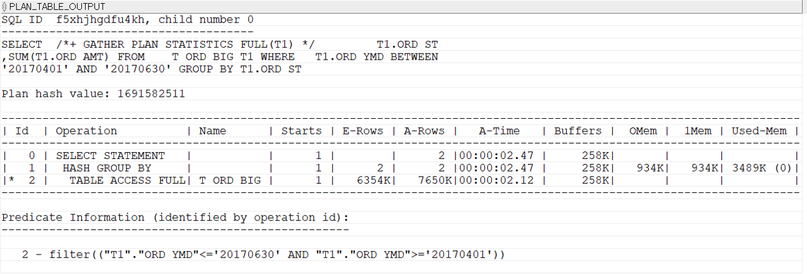

## 인덱스
인덱스는 색인이다. 색인이란 책 속의 내용 중에서 중요한 내용이나 단어를 찾아볼 수 있도록 별도로 배열하여 놓은 목록이다. 데이터베이스에서 인덱스 역시 테이블 내의 데이터를 찾을 수 있게 일부 데이터를 모아서 구성한 데이터 구조이다. 

#### 테스트를 위한 테이블 만들기
```sql
-- 테스트를 위한 테이블 만들기
-- PK까지 생성되진 않는다. alter 명령어로 추가해야함.
CREATE TABLE T_ORD_BIG AS
SELECT  T1.* ,T2.RNO ,TO_CHAR(T1.ORD_DT,'YYYYMMDD') ORD_YMD
FROM    T_ORD T1
        ,(SELECT ROWNUM RNO
          FROM DUAL CONNECT BY ROWNUM <= 10000) T2
          ;

-- 아래는 T_ORD_BIG 테이블의 통계를 생성하는 명령어다.
-- 첫 번째 파라미터에는 테이블 OWNER를, 두 번째 파라미터에는 테이블 명을 입력한다.
EXEC DBMS_STATS.GATHER_TABLE_STATS('ORA_SQL_TEST','T_ORD_BIG');
```
위 SQL을 실행하면 T_ORD_BIG 테이블에 3천만건 정도의 데이터가 입력된다. 성능 테스트에 충분한 양이다. 효율적인 성능 테스트와 인덱스 설명을 위해 'ORD_YMD'와 'RNO' 컬럼도 추가했다. 올바른 성능 테스트를 위해서는 위와 같이 통계정보를 반드시 만들어 주어야 한다.(DBMS_STATS의 실행권한이 필요하다.)

통계정보 생성까지 완료한 뒤, 아래와 같이 ORD_SEQ가 343인 데이터를 카운트한 뒤 실제 실행계획을 확인해보자.
```sql
-- 인덱스가 없는 BIG테이블 조회
SELECT  /*+ GATHER_PLAN_STATISTICS */ 
        COUNT(*) 
FROM    T_ORD_BIG T1 
WHERE   T1.ORD_SEQ = 343;

SELECT  T1.SQL_ID ,T1.CHILD_NUMBER ,T1.SQL_TEXT 
FROM    V$SQL T1
WHERE   T1.SQL_TEXT LIKE '%GATHER_PLAN_STATISTICS%'
ORDER BY T1.LAST_ACTIVE_TIME DESC;

--실제 실행계획 확인하기
SELECT  *
FROM    TABLE(DBMS_XPLAN.DISPLAY_CURSOR('3cn43y0ugqk9r',0,'ALLSTATS LAST'));
```

실행계획을 보니  약 0.9초 정도 걸렸다. 전체 Buffers(논리적IO)는 258K가 나왔다.  T_ORD_BIG 테이블에 "TABLE ACCESS FULL" 작업을 한 다음에 "SORT AGGREGATE(집계정렬)" 처리를 하고 있다. 테이블 전체를 읽어서 ORD_SEQ가 343인 데이터를 찾아내서 카운트 처리를 한 것이다. 

####

WHERE 조건절에 사용된 ORD_SEQ 컬럼에 인덱스를 만들어 보자. 아래 SQL을 이용한다.
```sql
-- ORD_SEQ 컬럼에 인덱스 구성
CREATE INDEX X_T_ORD_BIG_TEST ON T_ORD_BIG(ORD_SEQ);
```
데이터가 많아 인덱스 생성에 약간의 시간이 걸린다. 인덱스 생성이 완료되면 방금 실행했던 카운트 SQL을 다시 실행해보자. 

0.01초만에 SQL이 처리되었다. 전체 Buffers 수치를 보면 258K에서 24로 좋아졌다. 
"X_T_ORD_BIG_TEST" 인덱스를 "INDEX RANGE SCAN" 하고 있다. ORD_SEQ가 343인 데이터를 찾기 위해 인덱스를 이용한 것이다. 

인덱스를 만드는 것만으로 성능이 향상될 수 있다. 
ORD_SEQ 컬럼에 대한 데이터를 쉽게 찾아보기 위해 목차를 만들었다고 생각하면 쉽다.

#### 인덱스의 종류
- 단일 인덱스 : 인덱스에 하나의 컬럼만 사용
- 복합 인덱스 : 인덱스에 두 개 이상의 컬럼을 사용

가능하면 하나의 복합 인덱스로 여러 SQL을 커버하는 것이 좋다. SQL 별로 필요한 인덱스를 모두 만들다 보면 인덱스가 너무 많아진다.

**컬럼 값들의 중복 허용 여부에 따라서 분류하는 방법**
- 유니크 인덱스 : 인덱스 구성 컬럼들 값에 중복을 허용하지 않는다.
- 비유니크 인덱스 : 인덱스 구성 컬럼들 값에 중복을 허용한다.

유니크 인덱스로 지정된 컬럼들에는 중복된 값을 저장하지 못한다. PK 제약 조건에는 무조건 유니크 인덱스가 구성된다. 데이터베이스 설계 시점부터 업무적으로 유니크한 속성들을 파악해서 유니크 인덱스를 만들어 주는 것이 좋다.

**인덱스의 물리적인 구조에 따라서는 아래와 같이 분류한다.**
- B&#42;트리 인덱스 : 트리형태의 자료구조를 사용한다. OLTP 시스템은 대부분 B&#42;트리 인덱스를 사용한다. 
- 비트맵 인덱스

기준에 따른 인덱스 분류를 살펴보았다. 이러한 분류를 혼합해서 인덱스를 생성할 수 있다. 예를 들어, 복합 인덱스이면서 유니크인 B&#42;트리 인덱스를 만들거나, 단일 인덱스이면서 비트맵 형태로 인덱스를 만들 수 있다. 

#### B&#42;트리 구조와 탐색 방법
인덱스를 생성할 때 별다른 옵션을 정의하지 않으면 B&#42;트리 구조의 인덱스가 만들어진다. 트리는 원하는 데이터를 빠르게 찾기 위해 사용되는 대표적인 자료구조이다. 

인덱스를 구성하는 블록은 인덱스 블록이라고 한다. 위 블록 모두가 인덱스 블록이다. 

각각의 인덱스 블록이 존재하는 위치와 담고 있는 정보를 정리하면 아래와 같다.
- 루트블록
   - 최상위에 단 하나만 존재
   - 하위 브랜치 블록의 인덱스 키 값과 주소를 가지고 있다.
- 브랜치 블록
   - 루트와 리프의 중간에 위치, 브랜치는 여러 층이 있을 수 있다.
   - 하위 브랜치의 인덱스 키 값과 주소 또는 하위 리프의 키 값과 주소를 가지고 있다.
- 리프 블록
   - 최하위에만 위치
   - 인덱스 키 값과 데이터의 로우위치(ROWID)를 가지고 있다.
   - 리프 블록은 인덱스 키 값 순으로 정렬되어 있다. 

여기서 인덱스 키 값이란 인덱스를 구성하는 컬럼 데이터를 말한다. 

B&#42;트리 구조를 이용해 데이터를 찾아가는 과정을 단계적으로 살펴보자. ORD_YMD로 구성된 인덱스를 이용해 'ORD_YMD = 20170104'인 데이터를 찾아보자. 
1. 루트블록
ORD_YMD로 구성된 인덱스의 루트블록이다. 그림에서 루트 블록은 세개의 브랜치 블록(B05, B06, B01)을 찾아갈 수 있다. 찾으려는 '20170104'는 빈값보다 크고 '20170601'보다는 작다. 그러므로 브랜치 블록 중에 B05로 이동해야 한다.


2. 브랜치 블록
B05 브랜치 블록이다.
그림에서 B05 블록은 하위에 세 개의 리프블록(B02, B10, B21)을 가지고 있다. 찾으려는 '20170104'는 B10의 '20170102'보다 크고 B21의 '20170104'보다 작거나 같다. 그러므로 B10으로 이동해야 한다. 여기서 B21로 이동해야 한다고 착각할 수 있는데 B10의 뒷부분에도 '20170104'가 일부 있을 수 있다.


3. 리프블록 스캔
B10 블록의 마지막 부분에 '20170104'가 있다. 만약에 브랜치 블록에서 B21로 이동했다면 B10의 마지막에 저장된 '20170104'는 찾지 못한다. B10과 B21 블록은 리프블록이다. 리프블록은 인덱스에서 최하위 블록이므로 더는 하위 블록이 없다.

인덱스를 검색해서 리프 블록에 도달하면 이제는 리프블록을 차례대로 스캔해야 한다. 스캔 작업은 찾으려는 값보다 큰 값을 발견하기 전까지 수행한다. 여기서는 B10 블록의 첫 번째 데이터에서 시작해 B21블록의 '20170105'를 만날 때까지 스캔이 진행된다. 

이때 리프 블록을 스캔하면서 ROWID를 참고해 실제 테이블에 접근하는 작업을 수행한다. (ROWID는 데이터가 실제 저장된 주소 값이다.) 실행계획에 "TABLE ACCESS BY INDEX ROWID"라는 오퍼레이션으로 나타난다. 

#### 데이터를 찾는 방법
오라클에서 데이터를 찾는 방법은 아래와 같이 세 가지가 있다.
1. 테이블 전체 읽기(TABLE ACCESS FULL)
2. 인덱스를 이용한 찾기(INDEX RANGE SCAN & TABLE ACCESS BY INDEX ROWID)
3. ROWID를 이용한 직접 찾기(TABLE ACCESS BY INDEX ROWID)

**1. 테이블 전체 읽기**
테이블 전체 읽기는 찾고자 하는 조건에 활용할 인덱스가 없거나 인덱스보다 테이블 전체를 읽는 것이 더 효율적이라고 판단될 때 사용하는 방법이다.

오라클에서 데이터가 테이블에 저장될 때는 특정 순서를 갖지 않는다. 예를 들어, ORD_YMD가 '20170110'인 데이터가 저장될 때 물리적으로 '20170109' 다음에 위치한다고 장담할 수 없다.

WHERE 조건절에 사용된 컬럼에 인덱스가 없다면 '테이블 전체 읽기'만이 원하는 데이터를 찾을 수 있는 유일한 방법이다. 아래 SQL을 실행해보자.
```sql
-- TABLE ACCESS FULL을 사용하는 SQL
SELECT  /*+ GATHER_PLAN_STATISTICS */
        T1.CUS_ID ,COUNT(*) ORD_CNT
FROM    T_ORD_BIG T1
WHERE   T1.ORD_YMD = '20170316'
GROUP BY T1.CUS_ID
ORDER BY T1.CUS_ID;
```

테이블 전체 읽기는 테이블이 클 수록 오래걸린다. 만약에 천만 건의 데이터를 가진 테이블에서 찾고자 하는 데이터가 한 건이라면, 천만 건을 모두 읽어야 하는 엄청만 비효율이 발생한다. 이런 경우에는 인덱스를 사용하는 것이 효율적이다. 하지만 천만 건의 데이터를 가진 테이블에서 찾아야 하는 데이터가 백만 건 정도 된다면 인덱스를 사용하는 것보다 테이블 전체 읽기가 더 효율적일 수 있다.
####
**2. 인덱스를 이용한 찾기**
인덱스를 이용한 찾기는 'INDEX RANGE SCAN', 'INDEX SKIP SCAN', 'INDEX FULL SCAN'과 같이 다양한데 이 중 가장 기본인 'INDEX RANGE SCAN'을 살펴본다. 앞서 "B&#42;트리 구조와 탐색 방법"에서 루트에서 리프로 가능 과정과 리프 블록 스캔이 'INDEX RANGE SCAN'이라고 한다. 'INDEX RANGE SCAN'은 필요에 따라 'TABLE ACCESS BY INDEX ROWID' 작업을 동반한다. 인덱스 컬럼인 ORD_YMD값만 사용해 SQL을 처리할 수 있다면 테이블 액세스는 발생하지 않는다. 즉, ORD_YMD외의 다른 컬럼이 필요할 때 테이블 액세스가 발생한다. 

ORD_YMD 컬럼에 인덱스를 구성한 후에, ORD_YMD가 '20170316'인 데이터를 카운트해보자. 앞서 "TABLE ACCESS FULL"로 물리적 IO가 258K번 발생한 SQL이다. 
```sql
-- INDEX RANGE SCAN을 사용하는 SQL
CREATE INDEX X_T_ORD_BIG_1 ON T_ORD_BIG(ORD_YMD);

SELECT  /*+ GATHER_PLAN_STATISTICS INDEX(T1 X_T_ORD_BIG_1) */
        T1.CUS_ID ,COUNT(*) ORD_CNT
FROM    T_ORD_BIG T1
WHERE   T1.ORD_YMD = '20170316'
GROUP BY T1.CUS_ID
ORDER BY T1.CUS_ID;
```
'INDEX(T1 X_T_ORD_BIG_1)' 힌트를 사용해 인덱스를 사용하도록 강제하고 있다. 힌트는 SQL의 처리방법(실행계획)만 변경할 뿐 실행 결과에는 절대 영향을 주지 않는다. 

물리적 IO와 논리적 IO가 테이블 전체를 읽을 때보다 줄어들었다. 
WHERE 조건에 맞는 데이터를 찾기 위해 INDEX RAGNE SCAN을 사용했고, 인덱스에 없는 'CUS_ID' 값을 가져오기 위해 TABLE ACCESS BY INDEX ROWID 작업까지 수행한 것이다. 

#### INDEX RANGE SCAN vs TABLE ACCESS FULL
아래 SQL은 ORD_YMD 인덱스를 이용했을 때 성능이 더 좋은 SQL이다.
```sql
SELECT  /*+ GATHER_PLAN_STATISTICS */
        T1.CUS_ID ,COUNT(*) ORD_CNT
FROM    T_ORD_BIG T1
WHERE   T1.ORD_YMD = '20170316'
GROUP BY T1.CUS_ID
ORDER BY T1.CUS_ID;
```
T_ORD_BIG 테이블에는 총 3천만 건 정도의 데이터가 있다. 그 주에 ORD_YMD가 '20170316'인 데이터는 5만건 이다. 3천만건에서 5만 건 정도를 찾는 경우라면 INDEX RANGE SCAN이 효율적이다. 

이번에는 T_ORD_BIG 테이블에서 3개월간의 주문을 조회해보자. 약 7,650,000 건에 달하는 대량 데이터다. 힌트를 주었다.
```sql
-- 3개월간의 주문을 조회 – ORD_YMD컬럼 인덱스를 사용
SELECT  /*+ GATHER_PLAN_STATISTICS INDEX(T1 X_T_ORD_BIG_1) */
        T1.ORD_ST ,SUM(T1.ORD_AMT)
FROM    T_ORD_BIG T1
WHERE   T1.ORD_YMD BETWEEN '20170401' AND '20170630'
GROUP BY T1.ORD_ST;
```

TABLE ACCESS BY INDEX ROWID가 7,650k 번 실행되었다. TABLE ACCESS BY INDEX ROWID는 바로 전 단계 INDEX RANGE SCAN의 A-ROWs 만큼 실행된다. 매우 많은 랜덤 액세스가 발생했다.

같은 SQL을 'FULL' 힌트를 사용해 실행해보자. 테이블 전체 읽기 방식으로 실행된다.
```sql
-- 3개월간의 주문을 조회 – FULL(T1) 힌트 사용
SELECT  /*+ GATHER_PLAN_STATISTICS FULL(T1) */
        T1.ORD_ST ,SUM(T1.ORD_AMT)
FROM    T_ORD_BIG T1
WHERE   T1.ORD_YMD BETWEEN '20170401' AND '20170630'
GROUP BY T1.ORD_ST;
```

FULL 힌트를 사용하자 인덱스로 처리할 때보다 속도가 빨라졌다. 실행시간이 단축되었고 Buffers 수치도 258k로 좋아졌다. 찾고자 하는 데이터가 특정 수준 이상으로 많으면 인덱스를 이용한 랜덤 액세스보다 FULL SCAN 방식이 훨씬 효율적이다. 

정리하자면 아래와 같다.
- 적은 양의 데이터를 읽는다면 INDEX RANGE SCAN이 유리하다.
- 많은 양의 데이터를 읽어야 한다면 FULL SCAN이 유리할 수 있다.
- FULL SCAN은 데이터가 쌓일수록 성능이 점차 나빠진다. 테이블 관리전략이 필요하다. 
