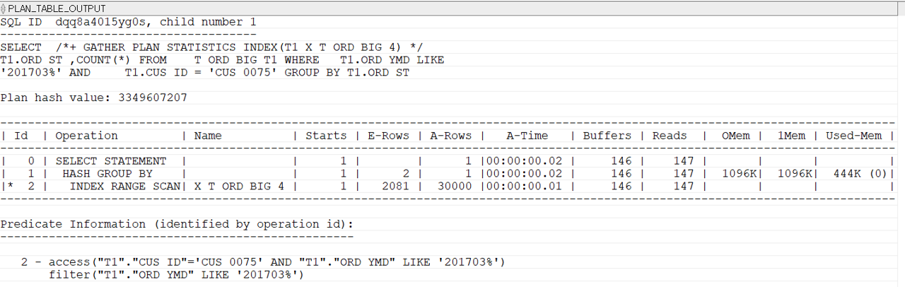

## 인덱스로 커버된 SQL
인덱스를 이용해 데이터를 검색할 때는 테이블 접근(TABLE ACCESS BY INDEX ROWID) 횟수를 줄이는 것이 매우 중요하다. 이 횟수를 얼만큼 줄이느냐에 따라 SQL의 성능이 좋아진다. 더 나아가 테이블 접근 자체가 생략된다면 성능에 가장 좋다.
```sql
-- CUS_ID, ORD_YMD인덱스를 사용하는 SQL
SELECT  /*+ GATHER_PLAN_STATISTICS INDEX(T1 X_T_ORD_BIG_4) */
        T1.ORD_ST ,COUNT(*)
FROM    T_ORD_BIG T1
WHERE   T1.ORD_YMD LIKE '201703%'
AND     T1.CUS_ID = 'CUS_0075'
GROUP BY T1.ORD_ST;
```

TABLE ACCESS BY INDEX ROWID 단계에서 buffers 수치가 30125로 급증했다. TABLE ACCESS BY INDEX ROWID을 하는 이유는 select 절에 ORD_ST 컬럼 때문이다.

```sql
-- X_T_ORD_BIG_4인덱스의 재생성
DROP INDEX X_T_ORD_BIG_4;
CREATE INDEX X_T_ORD_BIG_4 ON T_ORD_BIG(CUS_ID, ORD_YMD, ORD_ST);
```

전체 buffers가 146으로 탁월하게 줄었다. SQL에 필요한 모든 컬럼이 인덱스에 있으므로 TABLE ACCESS BY INDEX ROWID이 생략되었기 때문이다.

이처럼 테이블 접근없이 인덱스만으로 SQL이 처리되는 것을 인덱스로 커번된 SQL이라고 한다.

인덱스로 SQL을 완전히 커버하는 기술은 최후의 순간에만 사용하기 바란다. 
이유는 데이터의 변경성능이 나빠진다. 그리고 다른 컬럼이 추가될 수 있다.