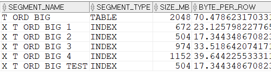

## 테이블과 인덱스크기 알아보기
```sql
-- 테이블 및 인덱스 크기 확인
SELECT  T1.SEGMENT_NAME ,T1.SEGMENT_TYPE
        ,T1.BYTES / 1024 / 1024 as SIZE_MB
        -- 테이블이나 인덱스크기를 데이터 건수로 나눔
        ,T1.BYTES / T2.CNT BYTE_PER_ROW
FROM    DBA_SEGMENTS T1
        ,(SELECT COUNT(*) CNT FROM ORA_SQL_TEST.T_ORD_BIG) T2
WHERE   T1.SEGMENT_NAME LIKE '%ORD_BIG%'
ORDER BY T1.SEGMENT_NAME;
```

데이터 한 건이 INSERT될 때 마다 테이블을 비롯해 모든 인덱스에 INSERT가 발생한다. 일반적으로 테이블에 대한 INSERT보다 인덱스에 대한 INSERT 부담이 더 크다. 인덱스는 리프 블록이 정렬되어야 하므로 꼭 정해진 위치에 데이터가 INSERT 되어야 하기 때문이다. 

위와 같은 상황에서 인덱스를 추가하는 것에 대해서는 신중하게 고민해보고 생성해야 한다. 