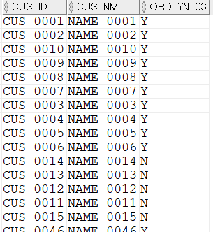

## 전체 고객을 조회하면서 3월에 주문이 존재하는지구하기
```sql
SELECT  T1.CUS_ID ,T1.CUS_NM
        ,(CASE  WHEN
                    EXISTS(
                        SELECT  *
                        FROM    T_ORD A 
                        WHERE   A.CUS_ID = T1.CUS_ID 
                        AND     A.ORD_DT >= TO_DATE('20170301','YYYYMMDD')
                        AND     A.ORD_DT < TO_DATE('20170401','YYYYMMDD')
                        ) 
            THEN 'Y' 
            ELSE 'N' END) ORD_YN_03
FROM    M_CUS T1;
```
