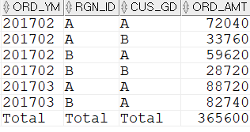

## 전체합계 구하기

```sql
SELECT  CASE  WHEN GROUPING(TO_CHAR(T2.ORD_DT,'YYYYMM'))=1 THEN 'Total' 
                ELSE TO_CHAR(T2.ORD_DT,'YYYYMM') END ORD_YM 
        ,CASE WHEN GROUPING(T1.RGN_ID) = 1 THEN 'Total' ELSE T1.RGN_ID END RGN_ID
        ,CASE WHEN GROUPING(T1.CUS_GD) = 1 THEN 'Total' ELSE T1.CUS_GD END CUS_GD
        ,SUM(T2.ORD_AMT) ORD_AMT
FROM    M_CUS T1
        ,T_ORD T2
WHERE   T1.CUS_ID = T2.CUS_ID
AND     T2.ORD_DT >= TO_DATE('20170201','YYYYMMDD')
AND     T2.ORD_DT < TO_DATE('20170401','YYYYMMDD')
        --지역코드
AND     T1.RGN_ID IN ('A','B')
-- ROLLUP안에 괄호가 두개이다. 전체합계만 구할 수 있다.
GROUP BY ROLLUP((TO_CHAR(T2.ORD_DT,'YYYYMM') ,T1.RGN_ID ,T1.CUS_GD))
ORDER BY TO_CHAR(T2.ORD_DT,'YYYYMM') ,T1.RGN_ID ,T1.CUS_GD;
```


위와 같이 작성하면 ROLLUP 안에 정의된 모든 컬럼이 하나로 인식되어, 전체합계만 구할 수 있다. 

ROLLUP 안의 두 번째 괄호 위치를 변경하면서 SQL을 수행하면 각각 다른 합계를 구하는 것을 볼 수 있다.
- 앞쪽 컬럼인 ORD_YM과 RGN_ID를 묶으면 ORD_YM과 RGN_ID별 소계와 전체 합계가 나온다.
- 뒤쪽 컬럼인 RGN_ID와 CUS_GD를 묶으면 ORD_YM 별 소계와 전체합계가 나온다.


ROLLUP 컬럼을 묶을 때 다음 두 가지만 기억하자.
1. GROUP BY A, B, C, D와 같이 여러 개 컬럼이 GROUP BY될 때, 전체합계만 필요하다면 GROUP BY ROLLUP((A, B, C, D))와 같이 사용한다. 

2. GROUP BY A, B, C, D, E, F와 같이 여러 개 컬럼 중, 앞쪽 3개 컬럼까지의 소계와 전체 합계가 필요하면(A+B+C별 소계, A+B별 소계, A별 소계, 전체합계) 소계가 필요없는 D, E, F를 하나로 묶어 버리면 된다. 즉, GROUP BY ROLLUP(A, B, C, (D, E, F))와 같이 구하면 된다. 