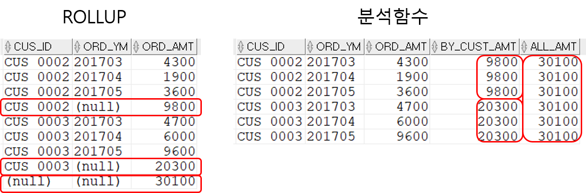
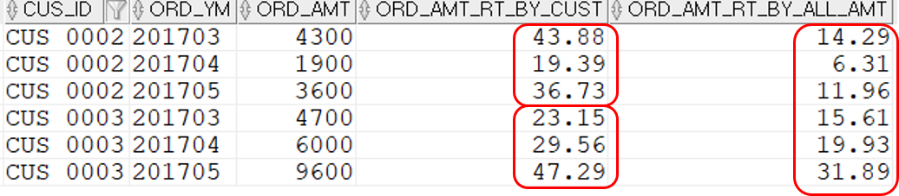
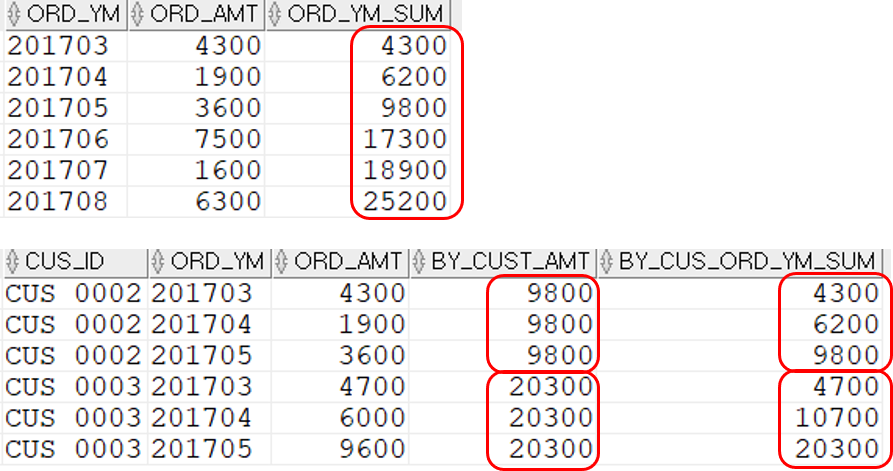

## 조회된 주문 건수를 마지막 컬럼에 추가하기
```sql
SELECT  T1.ORD_SEQ ,T1.CUS_ID ,T1.ORD_DT
        ,COUNT(*) OVER() ALL_CNT
FROM    T_ORD T1
WHERE   T1.ORD_DT >= TO_DATE('20170301','YYYYMMDD')
AND     T1.ORD_DT < TO_DATE('20170302','YYYYMMDD');
```
위에서 COUNT는 분석함수로 실행된다. over()는 분석함수 뒤에서 분석 대상을 지정하는 기능을 한다. **위와 같이 over의 괄호 안에 별다른 옵션을 주지 않으면 조회가 완료된 결과 전체가 분석 대상이다.**
- 분석함수와 GROUP BY가 동시에 사용될 때는, GROUP BY에 명시된 컬럼이나, 집계함수를 사용한 결과만 분석함수로 사용할 수 있다. 
-> **간단히 말하자면 분석함수를 사용하기 전 조회결과가 분석대상이 된다는 것만 기억하면 쉽다.**

#### 분석함수와 집계함수의 차이
```sql
SELECT  T1.CUS_ID
        ,COUNT(*) BY_CUS_ORD_CNT --집계함수: 고객별 주문건수
        ,COUNT(*) OVER() ALL_CUST_CNT  --분석함수: 조회된 고객 수(두 명이 나온다.)
        ,SUM(COUNT(*)) OVER() ALL_ORD_CNT  -- 분석함수: 2번 라인의 고객별 주문건수에 대한 합.
FROM    T_ORD T1
WHERE   T1.CUS_ID IN ('CUS_0002','CUS_0003')
AND     T1.ORD_DT >= TO_DATE('20170101','YYYYMMDD')
AND     T1.ORD_DT < TO_DATE('20170201','YYYYMMDD')
GROUP BY T1.CUS_ID;
```
결과는 아래와 같다.
|분석대상|분석대상|COUNT(*) OVER()|SUM(COUNT(*)) OVER()|              
|:--------:|:-------------:|:----------:|:---------:|
|**CUS_ID**  |**BY_CUS_ORD_CNT** |**ALL_CUST_CNT**|**ALL_ORD_CNT**|
|CUS_0002|3              |2           |6          |
|CUS_0003|3              |2           |6          |

먼저 CUS_ID와 BY_CUS_ORD_CNT로 한 분석대상이 나온다. 이 분석대상을 가지고 "COUNT(*) OVER()" 분석함수와  "SUM(COUNT(*)) OVER()" 분석함수가 실행된다. 

#### OVER-PARTITION BY
**1번**
```sql
SELECT  T1.CUS_ID ,TO_CHAR(T1.ORD_DT,'YYYYMM') ORD_YM
        ,SUM(T1.ORD_AMT) ORD_AMT
        ,SUM(SUM(T1.ORD_AMT)) OVER(PARTITION BY T1.CUS_ID) BY_CUST_AMT
FROM    T_ORD T1
WHERE   T1.CUS_ID IN ('CUS_0002','CUS_0003')
AND     T1.ORD_DT >= TO_DATE('20170301','YYYYMMDD')
AND     T1.ORD_DT < TO_DATE('20170601','YYYYMMDD')
GROUP BY T1.CUS_ID ,TO_CHAR(T1.ORD_DT,'YYYYMM')
ORDER BY T1.CUS_ID ,TO_CHAR(T1.ORD_DT,'YYYYMM');
```
|CUS_ID|ORD_YM|ORD_AMT|BY_CUST_AMT|
|:--:|:--:|:--:|:--:|
|CUS_0002	|201703	|4300	|9800|
|CUS_0002	|201704	|1900	|9800|
|CUS_0002	|201705	|3600	|9800|
|CUS_0003	|201703	|4700	|20300|
|CUS_0003	|201704	|6000	|20300|
|CUS_0003	|201705	|9600	|20300|

PARTITION BY CUS_ID라고 사용하면 위 결과와 같이 CUS_ID가 동일한 데이터만 분석대상이 된다. 즉, CUS_0002와 CUS_0003이 각각 따로 분석대상이 된다.

**2번**
```sql
SELECT  T1.CUS_ID ,TO_CHAR(T1.ORD_DT,'YYYYMM') ORD_YM ,T1.ORD_ST
        ,SUM(T1.ORD_AMT) ORD_AMT
        ,SUM(SUM(T1.ORD_AMT)) OVER(PARTITION BY T1.CUS_ID) BY_CUST_AMT
        ,SUM(SUM(T1.ORD_AMT)) OVER(PARTITION BY T1.ORD_ST) BY_ORD_ST_AMT
        ,SUM(SUM(T1.ORD_AMT)) OVER(PARTITION BY T1.CUS_ID, TO_CHAR(T1.ORD_DT,'YYYYMM')) BY_CUST_YM_AMT
FROM    T_ORD T1
WHERE   T1.CUS_ID IN ('CUS_0002','CUS_0003')
AND     T1.ORD_DT >= TO_DATE('20170301','YYYYMMDD')
AND     T1.ORD_DT < TO_DATE('20170601','YYYYMMDD')
GROUP BY T1.CUS_ID ,TO_CHAR(T1.ORD_DT,'YYYYMM') ,T1.ORD_ST
ORDER BY T1.CUS_ID ,TO_CHAR(T1.ORD_DT,'YYYYMM') ,T1.ORD_ST;
```
|CUS_ID|ORD_YM|ORD_ST|ORD_AMT|BY_CUST_AMT|BY_ORD_ST_AMT|BY_CUST_YM_AMT|
|:--:|:--:|:--:|:--:|:--:|:--:|:--:|
|CUS_0002	|201703	|COMP	|4300	|9800	|20500	|4300|
|CUS_0002	|201704	|COMP	|1900	|9800	|20500	|1900|
|CUS_0002	|201705	|COMP	|3600	|9800	|20500	|3600|
|CUS_0003	|201703	|COMP	|4700	|20300	|20500	|4700|
|CUS_0003	|201704	|COMP	|6000	|20300	|20500	|6000|
|CUS_0003	|201705	|WAIT	|9600	|20300	|9600	|9600|

#### ROULLUP과 PARTITION BY 비교
PARTITION BY도 소계를 구할 수 있다. 다만, ROLLUP은 소계를 로우로 추가하지만, 분석함수는  소계를 컬럼으로 추가한다. 
```sql
--ROLLUP
SELECT  T1.CUS_ID
        ,TO_CHAR(T1.ORD_DT,'YYYYMM') ORD_YM
        ,SUM(T1.ORD_AMT) ORD_AMT
FROM    T_ORD T1
WHERE   T1.CUS_ID IN ('CUS_0002','CUS_0003')
AND     T1.ORD_DT >= TO_DATE('20170301','YYYYMMDD')
AND     T1.ORD_DT < TO_DATE('20170601','YYYYMMDD')
GROUP BY
    ROLLUP(T1.CUS_ID,TO_CHAR(T1.ORD_DT,'YYYYMM'))
ORDER BY T1.CUS_ID,TO_CHAR(T1.ORD_DT,'YYYYMM');

--PARTITION BY
SELECT  T1.CUS_ID
        ,TO_CHAR(T1.ORD_DT,'YYYYMM') ORD_YM
        ,SUM(T1.ORD_AMT) ORD_AMT
        ,SUM(SUM(T1.ORD_AMT)) 
            OVER(PARTITION BY T1.CUS_ID) BY_CUST_AMT
        ,SUM(SUM(T1.ORD_AMT)) OVER() ALL_AMT
FROM    T_ORD T1
WHERE   T1.CUS_ID IN ('CUS_0002','CUS_0003')
AND     T1.ORD_DT >= TO_DATE('20170301','YYYYMMDD')
AND     T1.ORD_DT < TO_DATE('20170601','YYYYMMDD')
GROUP BY T1.CUS_ID,TO_CHAR(T1.ORD_DT,'YYYYMM')
ORDER BY T1.CUS_ID,TO_CHAR(T1.ORD_DT,'YYYYMM');
```


#### 고객별 주문금액 구하기
```sql
SELECT  T1.CUS_ID
        ,TO_CHAR(T1.ORD_DT,'YYYYMM') ORD_YM
        ,SUM(T1.ORD_AMT) ORD_AMT
        ,ROUND(SUM(T1.ORD_AMT) / (SUM(SUM(T1.ORD_AMT)) OVER(PARTITION BY T1.CUS_ID))
                * 100.00,2) ORD_AMT_RT_BY_CUST
        ,ROUND(SUM(T1.ORD_AMT) / (SUM(SUM(T1.ORD_AMT)) OVER()) * 100.00,2) ORD_AMT_RT_BY_ALL_AMT
FROM    T_ORD T1
WHERE   T1.CUS_ID IN ('CUS_0002','CUS_0003')
AND     T1.ORD_DT >= TO_DATE('20170301','YYYYMMDD')
AND     T1.ORD_DT < TO_DATE('20170601','YYYYMMDD')
GROUP BY T1.CUS_ID,TO_CHAR(T1.ORD_DT,'YYYYMM')
ORDER BY T1.CUS_ID,TO_CHAR(T1.ORD_DT,'YYYYMM');
```



#### ORDER BY
order by를 사용하면 누적금액이 표시된다.
```sql
-- 특정 고객의 3월부터 8월까지의 6개월 간의 주문 조회, 월별 누적주문금액을 같이 표시
-- 누적 금액: 아래 예를 참고
    -- 3월의 누적금액은 3월 주문 금액과 동일
    -- 4월의 누적금액은 3월과 4월 주문금액 합계
    -- ...
    -- 8월의 누적금액은 3~8월의 주문금액 합계
SELECT  TO_CHAR(T1.ORD_DT,'YYYYMM') ORD_YM
        ,SUM(T1.ORD_AMT) ORD_AMT
        ,SUM(SUM(T1.ORD_AMT)) OVER(ORDER BY TO_CHAR(T1.ORD_DT,'YYYYMM')) ORD_YM_SUM
FROM    T_ORD T1
WHERE   T1.CUS_ID = 'CUS_0002'
AND     T1.ORD_DT >= TO_DATE('20170301','YYYYMMDD')
AND     T1.ORD_DT < TO_DATE('20170901','YYYYMMDD')
GROUP BY TO_CHAR(T1.ORD_DT,'YYYYMM')
ORDER BY TO_CHAR(T1.ORD_DT,'YYYYMM');

-- 특정 고객의 두 명의 3월부터 5월까지의 월별 주문금액 조회, 고객별 누적주문금액을 같이 표시
SELECT  T1.CUS_ID ,TO_CHAR(T1.ORD_DT,'YYYYMM') ORD_YM
        ,SUM(T1.ORD_AMT) ORD_AMT
        ,SUM(SUM(T1.ORD_AMT)) OVER(PARTITION BY T1.CUS_ID) BY_CUST_AMT
        --PARTITION BY가 ORDER BY보다 먼저와야하며 둘 사이의 파티션 끝에 콤마가 오면 안된다.
        ,SUM(SUM(T1.ORD_AMT)) OVER(PARTITION BY T1.CUS_ID ORDER BY TO_CHAR(T1.ORD_DT,'YYYYMM')) 
BY_CUS_ORD_YM_SUM
FROM    T_ORD T1
WHERE   T1.CUS_ID IN ('CUS_0002','CUS_0003')
AND     T1.ORD_DT >= TO_DATE('20170301','YYYYMMDD')
AND     T1.ORD_DT < TO_DATE('20170601','YYYYMMDD')
GROUP BY T1.CUS_ID ,TO_CHAR(T1.ORD_DT,'YYYYMM')
ORDER BY T1.CUS_ID ,TO_CHAR(T1.ORD_DT,'YYYYMM');
```

