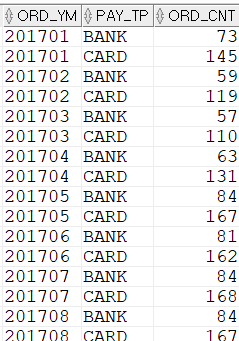

## 주문년월, 지불유형별 주문건수구하기
```sql
SELECT  TO_CHAR(T1.ORD_DT,'YYYYMM') ORD_YM ,T1.PAY_TP
        ,COUNT(*) ORD_CNT
FROM    T_ORD T1
WHERE   T1.ORD_ST = 'COMP' --주문상태
GROUP BY TO_CHAR(T1.ORD_DT,'YYYYMM') ,T1.PAY_TP --주문년월, 지불방법
ORDER BY TO_CHAR(T1.ORD_DT,'YYYYMM') ,T1.PAY_TP;
```
