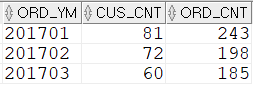
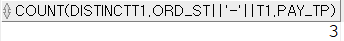

## 주문년월별 주문고객수(중복제거), 주문건수 구하기
- COUNT 집계함수는 NULL 값을 0으로 카운트한다. 
- COUNT(*)은 로우 자체의 건수를 카운트한다. 즉 NULL이어도 카운트한다. 
- 주문고객수는 주문년월별로 중복되지 않아야 한다. 즉, 2017년 1월에 A고객이 주문을 세 번했어도 1로만 카운트가 되어야 한다. 
```sql
SELECT  TO_CHAR(T1.ORD_DT,'YYYYMM') ORD_YM
        ,COUNT(DISTINCT T1.CUS_ID) CUS_CNT
        ,COUNT(*) ORD_CNT
FROM    T_ORD T1 --주문테이블
WHERE   T1.ORD_DT >= TO_DATE('20170101','YYYYMMDD') --주문년월
AND     T1.ORD_DT < TO_DATE('20170401','YYYYMMDD')
GROUP BY TO_CHAR(T1.ORD_DT,'YYYYMM')
ORDER BY TO_CHAR(T1.ORD_DT,'YYYYMM');
```


COUNT(DISTINCT)는 주문이 한 건이라도 존재하는 고객 수를 구하기 위해 사용할 수 있다.
COUNT(DISTINCT)는 여러 컬럼을 동시에 사용할 수 없다. 만약에 '주문상태와 지불유형'의 조합에 대한 종류 수가 필요하면 아래와 같이 작성하면 된다.

```sql
SELECT  COUNT(DISTINCT T1.ORD_ST||'-'||T1.PAY_TP)
FROM    T_ORD T1;
```


2개 컬럼을 파이프로 결합해 사용해야 한다. 아니면 아래와 같이 인라인 뷰로 해결할 수도 있다.
```sql
SELECT  COUNT(*)
FROM    (
        SELECT  DISTINCT T1.ORD_ST ,T1.PAY_TP
        FROM    T_ORD T1
        ) T2;
```
- COUNT(DISTINCT)는 아래와 같은 데이터를 구할 때 사용할 수 있다.
 - 한 번이라도 로그인이 있는 고객 수
 - 한 번이라도 사용 기록이 있는 메뉴 수
 - 한 번이라도 판매가 이루어진 아이템 수

위 경우들은 대부분 'SELECT~EXISTS'로도 구할 수 있다.
```sql
-- COUNT(DISTINCT)를 이용
SELECT COUNT(DISTINCT T1.고객ID)
FROM   로그인 T!;

--SELECT~EXITS를 이용
SELECT COUNT(*)
FROM   고객 T1
WHERE  EXITS(
         SELECT *
         FROM   로그인 A
         WHERE  A.고객ID = T1.고객ID);
