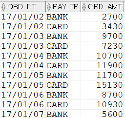

## 주문일시, 지불유형별 주문금액구하기
```sql
SELECT  T1.ORD_DT ,T1.PAY_TP 
       ,SUM(T1.ORD_AMT) ORD_AMT
FROM    T_ORD T1
WHERE   T1.ORD_ST = 'COMP'
GROUP BY T1.ORD_DT ,T1.PAY_TP
ORDER BY T1.ORD_DT ,T1.PAY_TP;
```


#### group by 사용 시 다음 규칙을 기억하자.
- GROUP BY에 사용한 컬럼만 SELECT 절에서 그대로 사용할 수 있다.
- GROUP BY 에 사용하지 않은 컬럼은 SELECT 절에서 집계함수를 사용해야 한다.