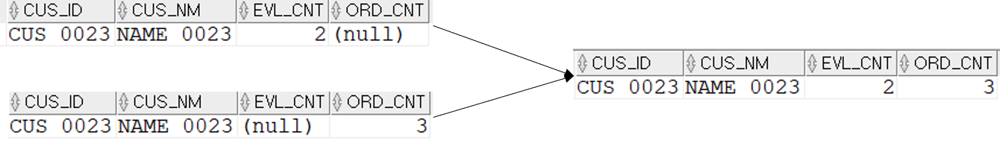
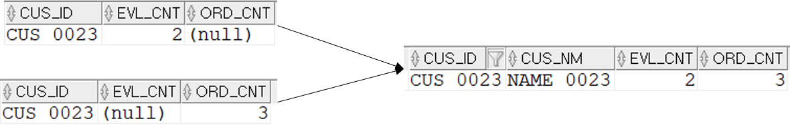
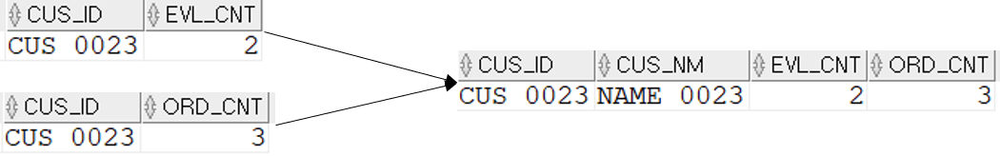

## 테이블이 M대1대M 관계일 때 해결법
M:1:M의 관계는 조인이 아닌 UNION ALL을 사용하거나, M:1을 먼저 1로 만든 후 나머지 조인을 사용해야 한다. 또는 모두 1로 만든 후 1:1:1 조인이 되도록 해야 한다.
여기서 1은 M_CUS 테이블이고, M은 T_ITM_EVL과 T_ORD이다. '기본세팅.md'에서 테이블 ERD를 참고하자.
#### 1. UNION ALL사용 #1
```sql
SELECT  T1.CUS_ID ,MAX(T1.CUS_NM) CUS_NM ,SUM(T1.EVL_CNT) EVL_CNT ,SUM(T1.ORD_CNT) ORD_CNT
FROM    (
        --T_ITM_EVL 테이블과 조인시 CUS_NM가 2건이상 나올 수 있기 때문에(T_ITM_EVL에 2건이상있을수 있기 때문)
        --1건만 나오게 하기 위해 MAX(T1.CUS_NM)을 사용
        SELECT  T1.CUS_ID ,MAX(T1.CUS_NM) CUS_NM ,COUNT(*) EVL_CNT ,NULL ORD_CNT
        FROM    M_CUS T1
                ,T_ITM_EVL T2 --아이템 평가 테이블
        WHERE   T1.CUS_ID = T2.CUS_ID
        AND     T2.CUS_ID = 'CUS_0023'
        AND     T2.EVL_DT >= TO_DATE('20170301','YYYYMMDD')
        AND     T2.EVL_DT < TO_DATE('20170401','YYYYMMDD')
        GROUP BY T1.CUS_ID ,T1.CUS_NM
        UNION ALL
        SELECT  T1.CUS_ID ,MAX(T1.CUS_NM) CUS_NM ,NULL EVL_CNT ,COUNT(*) ORD_CNT
        FROM    M_CUS T1
                ,T_ORD T3 --주문테이블
        WHERE   T1.CUS_ID = T3.CUS_ID
        AND     T3.CUS_ID = 'CUS_0023'
        AND     T3.ORD_DT >= TO_DATE('20170301','YYYYMMDD')
        AND     T3.ORD_DT < TO_DATE('20170401','YYYYMMDD')
        GROUP BY T1.CUS_ID ,T1.CUS_NM
        ) T1
GROUP BY T1.CUS_ID;
```


#### UNION ALL사용 #2
성능을 고려해 M_CUS에 대한 조인을 인라인-뷰 바깥으로 옮김.
M_CUS에 대한 반복을 제거했으므로 성능에 이득이 있을 수 있다.
```sql
SELECT  T1.CUS_ID ,MAX(T1.CUS_NM) CUS_NM ,SUM(T4.EVL_CNT) EVL_CNT ,SUM(T4.ORD_CNT) ORD_CNT
FROM    M_CUS T1
        ,(
        SELECT  T2.CUS_ID ,COUNT(*) EVL_CNT ,NULL ORD_CNT
        FROM    T_ITM_EVL T2
        WHERE   T2.CUS_ID = 'CUS_0023'
        AND     T2.EVL_DT >= TO_DATE('20170301','YYYYMMDD')
        AND     T2.EVL_DT < TO_DATE('20170401','YYYYMMDD')
        GROUP BY T2.CUS_ID
        UNION ALL
        SELECT  T3.CUS_ID ,NULL EVL_CNT ,COUNT(*) ORD_CNT
        FROM    T_ORD T3
        WHERE   T3.CUS_ID = 'CUS_0023'
        AND     T3.ORD_DT >= TO_DATE('20170301','YYYYMMDD')
        AND     T3.ORD_DT < TO_DATE('20170401','YYYYMMDD')
        GROUP BY T3.CUS_ID
        ) T4
WHERE   T1.CUS_ID = T4.CUS_ID
GROUP BY T1.CUS_ID;
```


#### 3. 1:1:1로 조인
1인 테이블은 그대로 두고, 나머지 M인 테이블들을 GROUP BY를 이용해 1로 만든후 조인을 수행한다.

```sql
SELECT  T1.CUS_ID
        ,T1.CUS_NM
        ,T2.EVL_CNT
        ,T3.ORD_CNT
FROM    M_CUS T1
        ,(
        SELECT  T2.CUS_ID
                ,COUNT(*) EVL_CNT
        FROM    T_ITM_EVL T2
        WHERE   T2.CUS_ID = 'CUS_0023'
        AND     T2.EVL_DT >= TO_DATE('20170301','YYYYMMDD')
        AND     T2.EVL_DT < TO_DATE('20170401','YYYYMMDD')
        GROUP BY T2.CUS_ID
        ) T2
        ,(
        SELECT  T3.CUS_ID
                ,COUNT(*) ORD_CNT
        FROM    T_ORD T3
        WHERE   T3.CUS_ID = 'CUS_0023'
        AND     T3.ORD_DT >= TO_DATE('20170301','YYYYMMDD')
        AND     T3.ORD_DT < TO_DATE('20170401','YYYYMMDD')
        GROUP BY T3.CUS_ID
        ) T3
WHERE   T1.CUS_ID = T2.CUS_ID
AND     T1.CUS_ID = T3.CUS_ID
AND     T1.CUS_ID = 'CUS_0023';
```


지금까지 이너 조인을 통해 결과를 추출했다. 만약에 T_ORD나 T_ITM_EVL에 없는 고객이면 조인 결과가 나오지 않는다. 무조건 조인 결과가 나오게 하려면 아우터-조인을 해야한다.