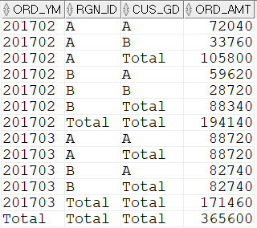
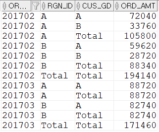
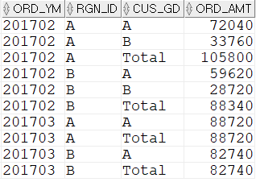

## 특정컬럼의 소계나 전체합계만 구하기
특정 컬럼의 소계만 필요하거나 전체 합계만 필요할 때가 있다. 이 때도 ROLLUP으로 해결할 수 있다. ROLLUP의 위치를 옮기거나 소계가 필요한 대상을 괄호로 조정하면 된다. 특히 전체 합계만 추가하는 기능은 매우 유용하다. 

```sql
SELECT  CASE  WHEN GROUPING(TO_CHAR(T2.ORD_DT,'YYYYMM'))=1 THEN 'Total' 
                ELSE TO_CHAR(T2.ORD_DT,'YYYYMM') END ORD_YM 
        ,CASE WHEN GROUPING(T1.RGN_ID) = 1 THEN 'Total' ELSE T1.RGN_ID END RGN_ID
        ,CASE WHEN GROUPING(T1.CUS_GD) = 1 THEN 'Total' ELSE T1.CUS_GD END CUS_GD
        ,SUM(T2.ORD_AMT) ORD_AMT
FROM    M_CUS T1
        ,T_ORD T2
WHERE   T1.CUS_ID = T2.CUS_ID
AND     T2.ORD_DT >= TO_DATE('20170201','YYYYMMDD')
AND     T2.ORD_DT < TO_DATE('20170401','YYYYMMDD')
AND     T1.RGN_ID IN ('A','B')
GROUP BY ROLLUP(TO_CHAR(T2.ORD_DT,'YYYYMM') ,T1.RGN_ID ,T1.CUS_GD)
ORDER BY TO_CHAR(T2.ORD_DT,'YYYYMM') ,T1.RGN_ID ,T1.CUS_GD;
```


위 SQL은 다음과 같은 소계와 전체합계를 만든다.
- TO_CHAR(T2.ORD_DT, 'YYYYMM'), T1.RGN_ID별 소계
- TO_CHAR(T2.ORD_DT, 'YYYYMM')별 소계
- 전체합계

위 SQL을 ROLLUP 위치만 변경해 가면서 실행해보자.
정리하면 아래와 같다.
- GROUP BY ROLLUP(A, B, C)
    - C ROLLUP => A+B별 소계
    - B, C ROLLUP => A별 소계
    - A, B, C ROLLUP => 전체합계
- GROUP BY A, ROLLUP(B, C)
    - C ROLLUP => A+B별 소계
    - B, C ROLLUP => A별 소계


- GROUP BY A, B, ROLLUP(C)
    - C ROLLUP => A+B별 소계
